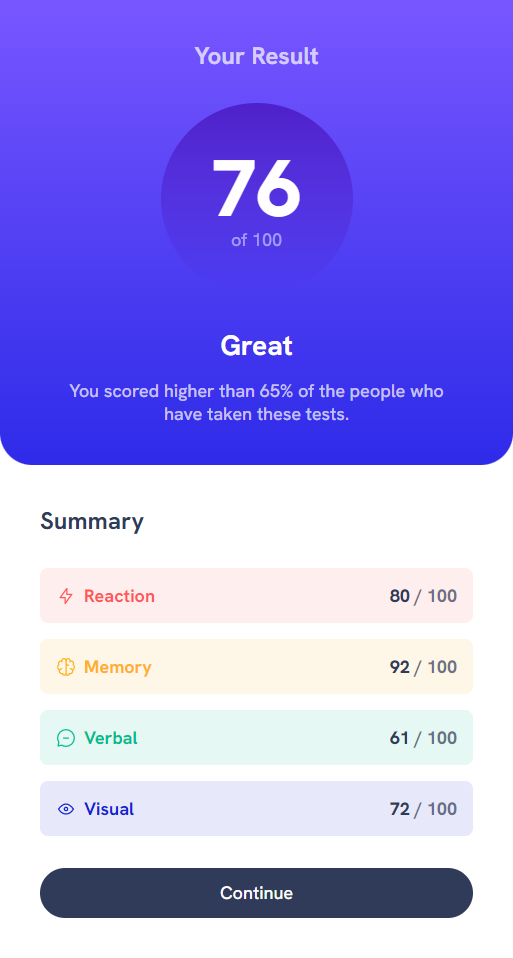
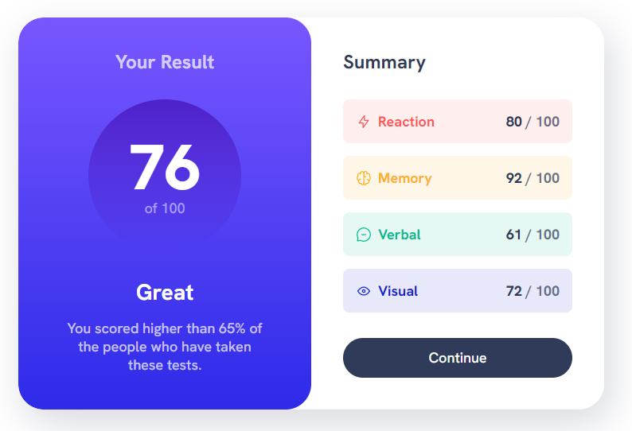

# Frontend Mentor - Results summary component solution

This is a solution to the [Results summary component challenge on Frontend Mentor](https://www.frontendmentor.io/challenges/results-summary-component-CE_K6s0maV). Frontend Mentor challenges help you improve your coding skills by building realistic projects.

## Table of contents

- [Overview](#overview)
  - [The challenge](#the-challenge)
  - [Screenshot](#screenshot)
  - [Links](#links)
- [My process](#my-process)
  - [Built with](#built-with)
  - [What I learned](#what-i-learned)
  - [Continued development](#continued-development)
  - [Useful resources](#useful-resources)
- [Author](#author)
- [Acknowledgments](#acknowledgments)

## Overview

### The challenge

Users should be able to:

- View the optimal layout for the interface depending on their device's screen size
- See hover and focus states for all interactive elements on the page

### Screenshot




### Links

- Solution URL: [github](https://github.com/Emmanuel-Xs/results-summary-component-main)
- Live Site URL: [netlify](https://summary-results101.netlify.app/)

## My process

When I started project, one of my mentor [Kevin Powell](https://www.youtube.com/kevinpowell) released a youtube video on this challenge. So I watched how he did it then tried doing it on my own and whenever I got stuck I go back and watch how he did it.

### Built with

- Semantic HTML5 markup
- CSS custom properties
- Flexbox
- CSS Grid
- Mobile-first workflow

### What I learned

I learnt that each components i.e `elements` work `hand-in-hand` like how the titles of both section can be styled together even though the title of the `result` section is an `h1` tag and that of the `summary` section is an `h2` tag.

Also similar components can be grouped together for easy styling and we can use `grid` or `flexbox` to separate or give `gap` to different components which is easier than using `margin` or `padding` and can be debugged easily and also responsive.

Using the custom property `--item-color` to make it easier to add colors to `summary-item` and its children so that it would easy to change in the future.

```css
.summary-item {
  background: hsl(var(--item-color), 0.1);
}

.summary-icon {
  stroke: hsl(var(--item-color));
}

.summary-item-title {
  color: hsl(var(--item-color));
}

.summary-item[data-item-type="accent-1"] {
  --item-color: var(--accent-1);
}

.summary-item[data-item-type="accent-2"] {
  --item-color: var(--accent-2);
}
```

### Continued development

I would love to do more challenges so that i can get more familiar with the new things i have learnt and also learn new stuff

### Useful resources

- [Kevin Powell](https://www.youtube.com/kevinpowell) - I did this challenge with the help of `Kevin Powell`. You can check his channel in youtube

## Author

- Github - [Emmanuel-Xs](https://github.com/Emmanuel-Xs)
- Frontend Mentor - [Emmanuel-Xs](https://www.frontendmentor.io/profile/Emmanuel-Xs)
- Twitter - [@Emma Nwaohiri](https://www.twitter.com/EmmaNwaohiri)

## Acknowledgments

My acknowledgements goes to `Kevin Powell`
